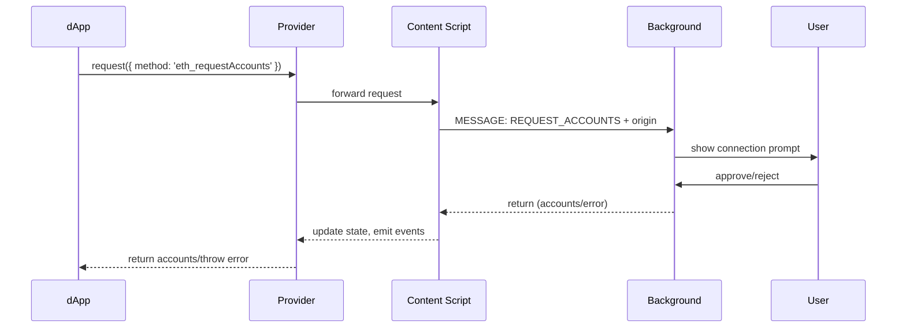
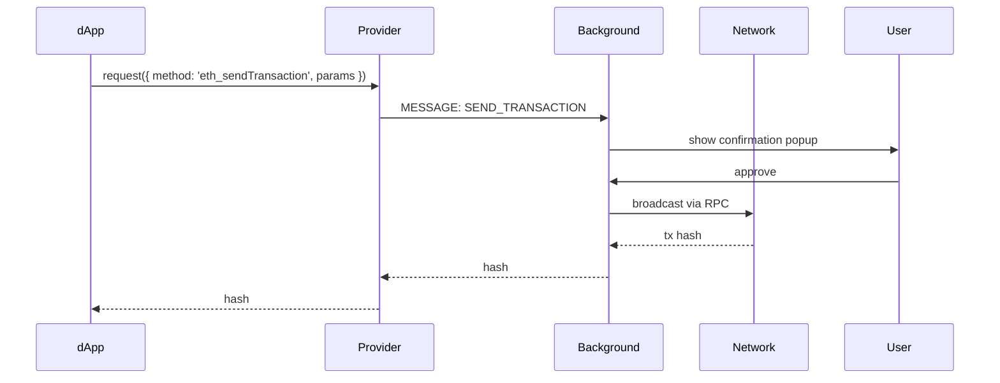
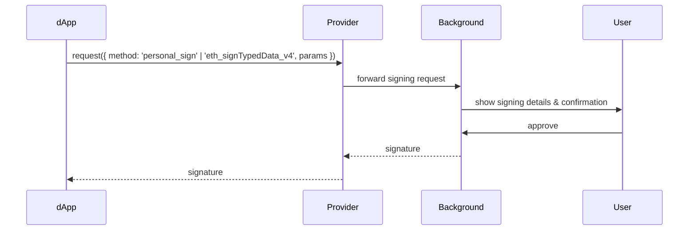
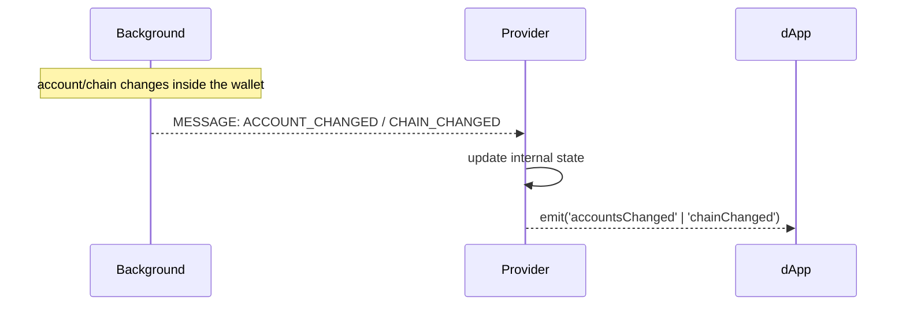

## dApp Connection (eth_requestAccounts)

```mermaid
sequenceDiagram
    participant D as dApp
    participant P as Provider
    participant C as Content Script
    participant B as Background
    participant U as User

    D->>P: request({ method: 'eth_requestAccounts' })
    P->>C: forward request
    C->>B: MESSAGE: REQUEST_ACCOUNTS + origin
    B->>U: show connection prompt
    U->>B: approve/reject
    B-->>C: return (accounts/error)
    C-->>P: update state, emit events
    P-->>D: return accounts/throw error
```

## Sending a Transaction (eth_sendTransaction)

```mermaid
sequenceDiagram
    participant D as dApp
    participant P as Provider
    participant B as Background
    participant N as Network
    participant U as User

    D->>P: request({ method: 'eth_sendTransaction', params })
    P->>B: MESSAGE: SEND_TRANSACTION
    B->>U: show confirmation popup
    U->>B: approve
    B->>N: broadcast via RPC
    N-->>B: tx hash
    B-->>P: hash
    P-->>D: hash
```

## Signing Data (personal_sign / eth_signTypedData_v4)

```mermaid
sequenceDiagram
    participant D as dApp
    participant P as Provider
    participant B as Background
    participant U as User

    D->>P: request({ method: 'personal_sign' | 'eth_signTypedData_v4', params })
    P->>B: forward signing request
    B->>U: show signing details & confirmation
    U->>B: approve
    B-->>P: signature
    P-->>D: signature
```

## Event Propagation

```mermaid
sequenceDiagram
    participant B as Background
    participant P as Provider
    participant D as dApp

    Note over B: account/chain changes inside the wallet
    B-->>P: MESSAGE: ACCOUNT_CHANGED / CHAIN_CHANGED
    P->>P: update internal state
    P-->>D: emit('accountsChanged' | 'chainChanged')
``` 