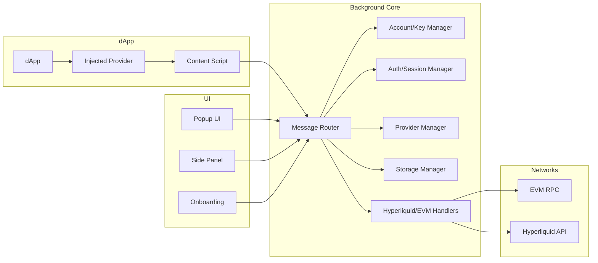

## Objectives
- Clear separation between Core (background/services), UI (popup/side panel), and Bridge (content script/injected provider)
- Protect keys and session, minimize attack surface
- Comply with Web3 standards (EIP-1193, EIP-6963, EIP-712) and remain multi-chain ready

## Core Components
- Background Core
  - Owns wallet state, accounts, connection flow, and confirmation lifecycle
  - Routes messages between UI, content script, and provider
  - Talks to EVM RPC and Hyperliquid services
- Provider System
  - Implements EIP-1193 and EIP-6963 so dApps can discover and use the wallet
  - Handles RPC methods and emits `accountsChanged`, `chainChanged`
  - Bridges communication to Background in a secure manner
- UI Layer (Popup, Side Panel, Onboarding)
  - User interface for confirmations, signing, and account management
  - Never holds keys; sensitive actions are delegated to Background
- Security Services
  - Data encryption (AES-256-GCM, PBKDF2)
  - Session management (offscreen + Chrome alarms)
  - Origin validation, per-site permissions, explicit user approvals

## Block Diagram

## Responsibilities and Trust Boundaries
- UI does not hold private keys; collects approvals and displays details only
- Background performs sensitive logic: key management, signing, broadcasting, encrypted storage
- Content Script is just a bridge; no sensitive processing
- The Provider is a façade that conforms to the Ethereum Provider standard for dApps

## Extensibility
- Handlers are modular by domain (account, auth, storage, evm, hyperliquid)
- Provider Manager abstracts multiple chains and RPC backends
- New chains/methods can be added via handler modules or registry-based switches

## Design Principles
- Security by default: locked by default, explicit approvals, session limits
- Least privilege: scope permissions to origin and action
- Resilience: strict validation, standardized error codes, safe error handling
- Observability: controlled logging and opt-in debug mode 